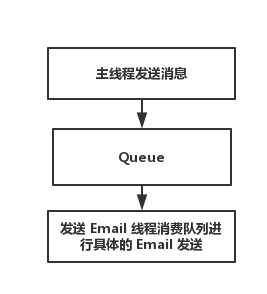

# 线程安全队列

在实践中常常会遇到使用本地内存队列的情况，多个线程使用一个队列，如果直接使用 STL 中的 `std::queue` 会存在线程安全的问题, Adbase 为了解决线程安全的问题，通过使用互斥锁和 `std::queue` 实现线程安全的内存队列

### 入队列

入队列操作比较简单，通过使用 `void push(T value)` 操作即可, 例如：

```
#include <adbase/Utility.hpp>
#include <adbase/Logging.hpp>

int main(void) {

    adbase::Queue<int> queue;
    LOG_INFO << "queue size: " << queue.getSize();
    queue.push(1);
    queue.push(2);
    LOG_INFO << "queue size: " << queue.getSize();
    return 0;
}
```

### 出队列

出队列的方式分为两种方式分别是非阻塞方式 `tryPop` 、阻塞方式 `waitPop`

##### 非阻塞方式

通过非阻塞方式出队列，无论队列中是否有数据都会返回，对于返回值有两种情况，一种是通过参数引用的方式返回数据副本，另一种通过返回 `std::shared_ptr<T>` 共享智能指针。其中通过参数引用出队列如果队列中有数据则返回 `true` 否则返回 `false`, 而通过返回智能指针的方式，如果没有数据则返回一个空指针

```cpp
#include <adbase/Utility.hpp>
#include <adbase/Logging.hpp>

int main(void) {

	adbase::Queue<int> queue;
	LOG_INFO << "queue size: " << queue.getSize();
	queue.push(1);
	queue.push(2);
	LOG_INFO << "queue size: " << queue.getSize();

	// tryPop 引用方式
	int value;
	bool isRet = queue.tryPop(value);
	if (isRet) {
		LOG_INFO << "Pop value:" << value;
	}
	LOG_INFO << "queue size: " << queue.getSize();

	// tryPop 智能指针
	std::shared_ptr<int> ptr = queue.tryPop();
	if (ptr) {
		LOG_INFO << "Pop value:" << *ptr;
	}
	LOG_INFO << "queue size: " << queue.getSize();
	LOG_INFO << "ptr before count:" << ptr.use_count();

	std::shared_ptr<int> p1 = ptr;
	LOG_INFO << "ptr after count:" << ptr.use_count();
	LOG_INFO << "p1 count:" << p1.use_count();

	ptr.reset();
	LOG_INFO << "ptr reset count:" << ptr.use_count();
	LOG_INFO << "p1 reset count:" << p1.use_count();

	p1.reset();
	LOG_INFO << "ptr reset count:" << ptr.use_count();
	LOG_INFO << "p1 reset count:" << p1.use_count();
	return 0;
}
```

##### 阻塞方式

阻塞方式的返回值得方式和非阻塞的类似都是通过参数引用方式和直接返回智能指针的方式, 最大的区别是该方式在队列中没有数据的时候回阻塞直到有数据返回为止, 内部实现原理是通过条件变量的方式现实, 一般用于生产消费模型, 例如发送 Email的模块，主线程负责发送消息到队列中，其中专门由另一个线程发送邮件, 如图



Email 发送线程主要职责就是负责消费队列数据，连接 Email stmp 服务器进行邮件发送，首先定义发送消息的结构体如下：

```cpp
#include <adbase/Utility.hpp>
#include <adbase/Logging.hpp>
#include <thread>
#include <atomic>

typedef enum {
	MESSAGE_TEXT = 0x01,
	MESSAGE_STOP = 0xff // 当判断发现消息类型是 stop 类型，发送邮件的线程退出
} MessageType;
typedef struct sendMessage {
	MessageType type;
	std::string data;
} Message;
void deleteThread(std::thread *t) {
	t->join();
	LOG_ERROR << "Consumer main thread stop.";
	delete t;
}
typedef std::unique_ptr<std::thread, decltype(&deleteThread)> ThreadPtr;

void threadFunc(void *data) {
	adbase::Queue<Message>* queue = reinterpret_cast<adbase::Queue<Message>*>(data);
	while(true) {
		Message message;
		queue->waitPop(message);
		if (message.type == MESSAGE_STOP) { // 如果是 stop 类型程序退出
			break;
		}

		// send mail....
		LOG_INFO << "send email data:" << message.data;
	}
}

int main(void) {
	adbase::Queue<Message> queue;
    ThreadPtr emailThread(new std::thread(std::bind(&threadFunc, std::placeholders::_1), &queue), &deleteThread);

	Message message;
	message.type = MESSAGE_TEXT;
	message.data = "text 1";
	queue.push(message);

    std::this_thread::sleep_for(std::chrono::seconds(1));
	message.type = MESSAGE_TEXT;
	message.data = "text 2";
	queue.push(message);
    std::this_thread::sleep_for(std::chrono::seconds(1));
	message.type = MESSAGE_TEXT;
	message.data = "text 3";
	queue.push(message);

    std::this_thread::sleep_for(std::chrono::seconds(1));
	message.type = MESSAGE_STOP;
	queue.push(message);

	emailThread.reset();
}
```
### 其他操作

##### 获取队列长度

```cpp
size_t len = queue.getSize();
```
##### 判断队列是否为空

```cpp
bool isEmpty = queue.empty();
```
