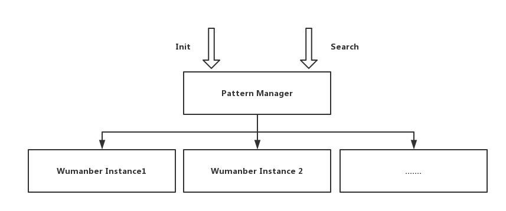

# 开发项目

### 项目配置

由于业务需求是支持多个关键字字典的匹配服务，所以我们要允许项目启动的时候通过配置文件配置关键词字典名称和对应的字典路劲，这样面临的问题是如何在 Adbase Seed 骨架代码上增加配置解析和配置读取以及配置定义

##### 配置定义

在骨架代码中增加一个全局的配置项，需要在 ini 配置文件增加配置项和在 AdbaseConfig 这个结构体总增加定义

修改 conf/system.ini 文件增加匹配服务本身的配置项，用来配置匹配服务支持的字典

```
[pattern]
dicta=./dicta.txt
dictb=./dictb.txt
```
	
[GITHUB代码段](https://github.com/weiboad/adbase_case/blob/master/pattern/conf/system.ini#L46-L48)

修改 src/AdbaseConfig.hpp 在 `AdbaseConfig` 这个结构体中增加属性 patternConfig 用来存储匹配关键字字典的映射关系

```c
std::unordered_map<std::string, std::string> patternConfig;
```
[GITHUB代码段](https://github.com/weiboad/adbase_case/blob/master/pattern/src/AdbaseConfig.hpp#L70)

##### 配置解析

在定义好配置项后下一步是通过解析 ini 配置文件，将配置文件中的配置项和 `AdbaseConfig` 这个全局的配置变量中的配置项关联起来，这块在骨架代码中启动的时候会将 Ini 配置文件解析，具体的 `AdbaseConfig` 关联是通过回调 `App->loadConfig` 这个方法实现的，所以我们要解析一个配置到全局配置中，需要在这个方法中实现，具体的操作如下：

修改后的 `App->loadCondig` 代码如下

```c
void App::loadConfig(adbase::IniConfig& config) {
    // 解析词库配置
    std::vector<std::string> patternKeys  = config.options("pattern");
    std::unordered_map<std::string, std::string> patternConfig;
    for (auto & t : patternKeys) {
        patternConfig[t] = config.getOption("pattern", t);
    }
    _configure->patternConfig = patternConfig;
}
```
[GITHUB代码段](https://github.com/weiboad/adbase_case/blob/master/pattern/src/App.cpp#L82-L90)

##### 配置读取

在解析了配置后，需要在项目中用到配置对于 `App` 这个对象中提供一个 `_configure` 指针，开发者可以将该指针进行传递来读取配置，对于该项目我们将在下面的匹配服务核心逻辑实现时会用到

### 匹配服务核心逻辑实现

匹配服务核心逻辑分为两部分，一部分是 Wumanber 算法的实现，一部分是用来管理 Wumanber 对象的。如图所示



多个 `Wumanber` 实例对应多个匹配关键字字典，对于后面的 RPC 调用直接和 Pattern Manager 这个对象交互，分别有两个交互方法，一个是在系统启动的时候加载关键词字典并初始化 Wumanber 的 `Init` 方法， 一个是提供匹配的检索方法`Search`


##### Wumanber 算法实现

在 src 中创建目录 `app` , 并且创建对应的 `Wumanber.cpp` 和 `Wumanber.hpp`

```cpp
// src/app/Wumanber.hpp

#ifndef PATTERN_WUMANBER_HPP
#define PATTERN_WUMANBER_HPP
#include <stdint.h>

#include <vector>
#include <string>
#include <set>

namespace app {

typedef std::set<std::string> ResultSetType;
typedef std::pair<unsigned int, int> PrefixIdPairType;
typedef std::vector<PrefixIdPairType> PrefixTableType;

class WuManber {
    public:
        WuManber();
        ~WuManber();

        /**
         * init Function
         * 
         * @param patterns      pattern list to be matched
         */
        bool init(const std::vector<std::string>& patterns);

        /** 
         * @param text           raw text
         * @param textLength     length of text
         * @param res            string set containing matched patterns
         * 
         * @return value 0: no pattern matchs, n: n patterns matched(n>0)
         */
        int search( const char* text, const int textLength, ResultSetType& res);

        /**
         * @param  str           raw text
         * @param  res           string set containing matched patterns
         *
         * @return value 0: no pattern matchs, n: n patterns matched(n>0)
         */
         int search(const std::string& str, ResultSetType& res);

        /**
         * @brief search text 
         *
         * @return value 0: no pattern matchs, n: n patterns matched(n>0)
         */
        int search(const char* text, const int textLength);

        /**
         * @brief search text
         *
         * @return value 0: no pattern matchs, n: n patterns matched(n>0)
         */
        int search(const std::string& str);

    private:
        // minmum length of patterns
        int32_t mMin;
        // SHIFT table
        std::vector<int32_t> mShiftTable;
        // a combination of HASH and PREFIX table 
        std::vector<PrefixTableType> mHashTable;
        // patterns
        std::vector<std::string> mPatterns;
        // size of SHIFT and HASH table
        int32_t mTableSize;
        // size of block
        int32_t mBlock;
};
}

#endif
```

[GITHUB代码段](https://github.com/weiboad/adbase_case/blob/master/pattern/src/app/WuManber.hpp)

```cpp
// src/app/Wumanber.cpp
#include <cmath>
#include <iostream>
#include <adbase/Logging.h>
#include "WuManber.hpp"

using namespace std;

namespace app {
// {{{ hashCode()

/** 
 * @brief   String hash function.
 * 
 * @param str   the string needed to be hashed
 * @param len   length of the substr should be hashed
 * 
 * @return hash code
 */
unsigned int hashCode(const char* str, int len) {
    unsigned int hash = 0;
    while (*str && len>0) {
        hash = (*str++) + (hash << 6) + (hash << 16) - hash;
        --len;
    }
    return (hash & 0x7FFFFFFF);
}

// }}}
// {{{ WuManber::WuManber()

/** 
 * @brief constructor 
 */
WuManber::WuManber() : mMin(0), mTableSize(0), mBlock(3) {
    //VOID
}

// }}}
// {{{ WuManber::init()

/**
 * @brief init
 */
bool WuManber::init(const vector<string>& patterns) {
    int patternSize = patterns.size();

    //check if no pattern specified
    if (patternSize == 0) {
		LOG_ERROR << "wumanber init failed because no pattern specified.";
        return false;
    }
    
    //caculate the minmum pattern length
    mMin = patterns[0].length();
    int32_t lenPattern = 0;
    for (int i = 0; i < patternSize; ++i) {
        lenPattern = patterns[i].length();
        if (lenPattern < mMin) {
            mMin = lenPattern;
        }
    }

    //check if mBlock larger than mMin
    if (mBlock > mMin) {
		LOG_WARN << "mBlock is larger than minmum pattern length, reset mBlock to minmum, but it will seriously affect the effiency.";
        mBlock = mMin;
    }

    //choose a suitable mTableSize for SHIFT, HASH table
    int32_t primes[6] = {1003, 10007, 100003, 1000003, 10000019, 100000007};
    vector<int32_t> primeList(&primes[0], &primes[6]);

    int32_t threshold = 10 * mMin;
    for (size_t i = 0; i < primeList.size(); ++i) {
        if (primeList[i] > patternSize && primeList[i] / patternSize > threshold) {
            mTableSize = primeList[i];
            break;
        }
    }
    
    //if size of patternList is huge.
    if (0 == mTableSize) {
		LOG_WARN << "amount of pattern is very large, will cost a great amount of memory.";
        mTableSize = primeList[5];
    }

    //construct ShiftTable and HashTable, and set default value for SHIFT table
    mPatterns = patterns;
    mHashTable.resize(mTableSize);
    // default value is m-mBlock+1 for shift
    int32_t defaultValue = mMin - mBlock + 1;
    mShiftTable.resize(mTableSize, defaultValue);

    //loop through patterns
    for (int id = 0; id < patternSize; ++id) { 
        // loop through each pattern from right to left
        for (int index = mMin; index >= mBlock; --index) {
            unsigned int hash = hashCode(patterns[id].c_str() + index - mBlock, mBlock) % mTableSize;
            if (mShiftTable[hash] > (mMin - index)) {
                mShiftTable[hash]  = mMin - index;
            }
            if (index == mMin) {
                unsigned int prefixHash = hashCode(patterns[id].c_str(), mBlock);
                mHashTable[hash].push_back(make_pair(prefixHash, id));
            }
        }
    }

    return true;
}

// }}}
// {{{ WuManber::~WuManber()

/** 
 * @brief destructor
 */
WuManber::~WuManber() {
    //VOID
}

// }}}
// {{{ WuManber::search()

/**
 * @public
 * @brief search multiple pattern in text at one time
 */
int WuManber::search(const char* text, const int textLength, ResultSetType& res) {
    //hit count: value to be returned
    int hits = 0;
    int32_t index = mMin - 1; // start off by matching end of largest common pattern
    
    int32_t blockMaxIndex = mBlock - 1;
    int32_t windowMaxIndex = mMin - 1;
    
    while (index < textLength) {
        unsigned int blockHash = hashCode(text + index - blockMaxIndex, mBlock);
        blockHash = blockHash % mTableSize;
        int shift = mShiftTable[blockHash];
        if (shift > 0) {
            index += shift;
        } else {  
            // we have a potential match when shift is 0
            unsigned int prefixHash = hashCode(text + index - windowMaxIndex, mBlock);
            PrefixTableType &element = mHashTable[blockHash];
            PrefixTableType::iterator iter = element.begin();

            while (element.end() != iter) {
                if (prefixHash == iter->first) {   
                    // since prefindex matches, compare target substring with pattern
                    // we know first two characters already match
                    const char* indexTarget = text + index - windowMaxIndex;    //+mBlock
                    const char* indexPattern = mPatterns[iter->second].c_str(); //+mBlock
                    
                    while (('\0' != *indexTarget) && ('\0' != *indexPattern)) {
                        // match until we reach end of either string
                        if (*indexTarget == *indexPattern) {
                            // match against chosen case sensitivity
                            ++indexTarget;
                            ++indexPattern;
                        } else {
                            break;
						}
                    }
                    // match succeed since we reach the end of the pattern.
                    if ('\0' == *indexPattern) {
                        res.insert(string(mPatterns[iter->second]));
                        ++hits;
                    }
                } //end if
                ++iter;
            } //end while
            ++index;
        } //end else
    } //end while

    return hits;
}

// }}}
// {{{ WuManber::search()

/**
 * search
 */
int WuManber::search(const string& str, ResultSetType& res) {
    return search(str.c_str(), str.length(), res);
}

// }}}
// {{{ WuManber::search()

/**
 * search
 */
int WuManber::search(const char* text, const int textLength) {
    //hit count: value to be returned
    int hits = 0;
    int index = mMin - 1; // start off by matching end of largest common pattern

    uint32_t blockMaxIndex = mBlock - 1;
    uint32_t windowMaxIndex = mMin - 1;

    while (index < textLength) {
        unsigned int blockHash = hashCode(text + index - blockMaxIndex, mBlock);
        blockHash = blockHash % mTableSize;
        int shift = mShiftTable[blockHash];
        if (shift > 0) {
            index += shift;
        } else {
            // we have a potential match when shift is 0
            unsigned int prefixHash = hashCode(text + index - windowMaxIndex, mBlock);
            //prefixHash = prefixHash % mTableSize;
            PrefixTableType &element = mHashTable[blockHash];
            PrefixTableType::iterator iter = element.begin();

            while (element.end() != iter) {
                if (prefixHash == iter->first) {
                    // since prefindex matches, compare target substring with pattern
                    // we know first two characters already match
                    const char* indexTarget = text + index - windowMaxIndex;    //+mBlock
                    const char* indexPattern = mPatterns[iter->second].c_str();  //+mBlock

                    while (('\0' != *indexTarget) && ('\0' != *indexPattern)) {
                        // match until we reach end of either string
                        if (*indexTarget == *indexPattern) {
                            // match against chosen case sensitivity
                            ++indexTarget;
                            ++indexPattern;
                        } else {
                            break;
						}
                    }
                    // match succeed since we reach the end of the pattern.
                    if ('\0' == *indexPattern) {
                        ++hits;
                    }
                }//end if
                ++iter;
            }//end while
            ++index;
        }//end else
    }//end while

    return hits;
}

// }}}
// {{{ WuManber::search()

int WuManber::search(const string& str) {
    return search(str.c_str(), str.length());
}

// }}}
}
```

[GITHUB代码段](https://github.com/weiboad/adbase_case/blob/master/pattern/src/app/WuManber.cpp)

##### 实现 Wumanber 管理类

用来管理多个 Wumanber 实例，读取多个关键字字典并初始化对应 Wumanber 实现, 创建对应 `PatternManager.hpp` 和 `PatternManager.cpp`

```cpp
// src/app/PatternManager.hpp
fndef PATTERN_PATTERNMANAGER_HPP_
#define PATTERN_PATTERNMANAGER_HPP_

#include <unordered_map>
#include "AdbaseConfig.hpp"
#include "WuManber.hpp"
#include <fstream>
#include <set>

namespace app {

typedef std::unordered_map<std::string, std::string> PatternConfig;
typedef std::unordered_map<std::string, WuManber*> WuManberMap;
class PatternManager {
public:
    PatternManager(AdbaseConfig* config);
    void init();
    int search(std::string& type, std::string& text, std::set<std::string>& patternResult);
    int search(std::string& type, std::string& text);
    ~PatternManager();

private:
    AdbaseConfig* _config;
    WuManberMap _wuManbers;
};

}

#endif
```

[GITHUB代码段](https://github.com/weiboad/adbase_case/blob/master/pattern/src/app/PatternManager.hpp)


```cpp
// src/app/PatternManager.cpp
#include "PatternManager.hpp"
#include <adbase/Logging.hpp>

namespace app {
// {{{ PatternManager::PatternManager()

PatternManager::PatternManager(AdbaseConfig* config) :
    _config(config) {
}

// }}}
// {{{ PatternManager::~PatternManager()

PatternManager::~PatternManager() {
    if (!_wuManbers.size()) {
        return;
    }

    for (auto & t: _wuManbers) {
        if (t.second != nullptr) {
            delete t.second;
            t.second = nullptr;
        }
    }
}

// }}}
// {{{ void PatternManager::init()

void PatternManager::init() {
    if (!_config->patternConfig.size()) {
        LOG_FATAL << "Must has pattern text config.";
    }

    for (auto &t : _config->patternConfig) {
        std::vector<std::string> patterns;
        std::ifstream pat(t.second);
        if (!pat.good() || !pat.is_open()) {
            LOG_FATAL << "Pattern type :" << t.first << " config file: " << t.second << " is not good.";
        }
        std::string str;
        while (pat>> str) {
            patterns.push_back(str);
        }

        WuManber* wumanber = new WuManber;
        wumanber->init(patterns);
        _wuManbers[t.first] = wumanber; 
        LOG_INFO << "Init dict " << t.first << " complete.";
    }
}

// }}}
// {{{ int PatternManager::search() 

int PatternManager::search(std::string& type, std::string& text, std::set<std::string>& patternResult) {
    if (_wuManbers.find(type) == _wuManbers.end()) {
        LOG_INFO << "Search pattern type `" << type << "` not exists."; 
        return -1;
    }   

    WuManber* wumanber = _wuManbers[type];
    wumanber->search(text, patternResult);
    return static_cast<int>(patternResult.size());
}

// }}}
// {{{ int PatternManager::search() 

int PatternManager::search(std::string& type, std::string& text) {
    if (_wuManbers.find(type) == _wuManbers.end()) {
        LOG_INFO << "Search pattern type `" << type << "` not exists."; 
        return -1;
    }   

    WuManber* wumanber = _wuManbers[type];
    return wumanber->search(text);
}

// }}}
}
```

[GITHUB代码段](https://github.com/weiboad/adbase_case/blob/master/pattern/src/app/PatternManager.cpp)

##### 配置构建文件

修改 CMake 构建配置文件 `src/CMakeLists.txt`，增加上述两个 cpp 源文件

```
app/Wumanber.cpp
app/PatternManager.cpp
```

[GITHUB代码段](https://github.com/weiboad/adbase_case/blob/master/pattern/src/CMakeLists.txt#L34-L35)


### App 对象增加 PatternManager 属性

由于 PatternManager 对象实例在整个项目的生命周期都存在，所以我们将 PatternManager 对象保存在 App 这个对象中，在后面的 RPC 调用时通过 AdServer 上下文的方式将 PatternManager 的指针传递过去即可调用

##### 创建对象

App.hpp 中引入 PatternManager.hpp

```cpp
#include "app/PatternManager.hpp"
```
[GITHUB代码段](https://github.com/weiboad/adbase_case/blob/master/pattern/src/App.hpp#L6)

在 App.hpp 中增加 PatternManager 指针属性

```cpp
app::PatternManager* _patternManager;
```
[GITHUB代码段](https://github.com/weiboad/adbase_case/blob/master/pattern/src/App.hpp#L23)

在 `App->run` 中创建 PatternManager 对象

```
void App::run() {
    _patternManager = new app::PatternManager(_configure);
    _patternManager->init();
}
```
[GITHUB代码段](https://github.com/weiboad/adbase_case/blob/master/pattern/src/App.cpp#L44-L47)

在 `App->stop` 中销毁 PatternManager 对象

```
void App::stop() {
    if (_patternManager != nullptr) {
        delete _patternManager;
        _patternManager = nullptr;
    }
}
```
[GITHUB代码段](https://github.com/weiboad/adbase_case/blob/master/pattern/src/App.cpp#L58-L63)

##### 设置 Adserver 上下文

设置 Adserver 上下文指针供 Adserver 调用

修改 AdbaseConfig.cpp 中 adserverContext 这个结构体，在该结构体中增加一个属性 `patternManager`

```cpp
app::PatternManager* patternManager;
```
[GITHUB代码段](https://github.com/weiboad/adbase_case/blob/master/pattern/src/AdbaseConfig.hpp#L83)


为了防止依赖，我们采用前置申明的方式声明 `app::PatternManager`

```cpp
namespace app {
	class PatternManager;
}
```
[GITHUB代码段](https://github.com/weiboad/adbase_case/blob/master/pattern/src/AdbaseConfig.hpp#L74-L76)

修改 `App::setAdServerContext` 方法

```cpp
void App::setAdServerContext(AdServerContext* context) {
	context->app = this;
	context->patternManager = _patternManager;
}
```
[GITHUB代码段](https://github.com/weiboad/adbase_case/blob/master/pattern/src/App.cpp#L68-L71)

这样后面 AdServer 中通过使用 `context->patternManager` 的方式就可以引用匹配管理对象实例了

### 引入 Json 库

首先由于接口交互都是 Json 格式所以我们需要引入 

```shell
git submodule add https://github.com/miloyip/rapidjson.git pattern/src/thirdparty/rapidjson
```

修改项目构建配置文件 `src/CMakeLists.txt`, 增加如下配置

```
INCLUDE_DIRECTORIES(./thirdparty/rapidjson/include)
```
[GITHUB代码段](https://github.com/weiboad/adbase_case/blob/master/pattern/src/CMakeLists.txt#L3)

将 rapidjson 下载到 `src/thirdparty/rapidjson` 目录中, 在 `src/app` 中创建 `Json.hpp` 引入 json 头文件，后面再使用json库的时候直接引用即可

```cpp
// src/app/Json.hpp
#ifndef PATTERN_JSON_HPP_
#define PATTERN_JSON_HPP_

#pragma GCC diagnostic ignored "-Wconversion"
#pragma GCC diagnostic ignored "-Wold-style-cast"
#include "rapidjson/document.h"
#include "rapidjson/error/en.h"
#include "rapidjson/stringbuffer.h"
#include "rapidjson/writer.h"
#pragma GCC diagnostic warning "-Wconversion"
#pragma GCC diagnostic warning "-Wold-style-cast"

#endif
```
[GITHUB代码段](https://github.com/weiboad/adbase_case/blob/master/pattern/src/app/Json.hpp)

### 开发 HTTP 接口

到目前为止我们的匹配服务的核心逻辑已经实现，暴露出来一个方法 `search` 可以用来匹配, 通过设置上面设置 Adserver 的上下文指针 `PatternManager*` 来调用 search 方法

在 `Http/Api.hpp` 和 `Http/Api.cpp` 增加接口方法 `pattern` 的声明和实现

```cpp
void pattern(adbase::http::Request* request, adbase::http::Response* response, void*);
```
[GITHUB代码段](https://github.com/weiboad/adbase_case/blob/master/pattern/src/Http/Api.hpp#L13)

##### 实现接口逻辑

```cpp
void Api::pattern(adbase::http::Request* request, adbase::http::Response* response, void*) {
    std::string data = request->getPostData();
    rapidjson::Document documentData;
    documentData.Parse(data.c_str());
    if (documentData.HasParseError()) {
        LOG_ERROR << rapidjson::GetParseError_En(documentData.GetParseError());
	    responseJson(response, "", 10000, rapidjson::GetParseError_En(documentData.GetParseError()), true);
        return;
    }

    if (!documentData.IsObject()) {
        std::string error = "pattern format is invalid.";
        LOG_ERROR << error;
	    responseJson(response, "", 10000, error, true);
        return;
    }

    if (!documentData.HasMember("dict") || !documentData.HasMember("contents")) {
        std::string error = "pattern format is invalid.";
        LOG_ERROR << error;
	    responseJson(response, "", 10000, error, true);
        return;
    }

    rapidjson::Value& contents = documentData["contents"];
    if (!contents.IsArray() || !static_cast<uint32_t>(contents.Size())) {
        std::string error = " contents not is array or empty.";
        LOG_ERROR << error;
	    responseJson(response, "", 10000, error, true);
        return;
    }

    std::string patternType = documentData["dict"].GetString();

    rapidjson::Document document;
    rapidjson::Document::AllocatorType& allocator = document.GetAllocator();
    rapidjson::Value result(rapidjson::kArrayType);
    for (int i = 0; i < static_cast<int>(contents.Size()); i++) {
        if (!contents[i].IsString()) {
            continue;
        }

        rapidjson::Value item(rapidjson::kObjectType);
        std::set<std::string> patternResult;
        std::string text = std::string(contents[i].GetString());
        LOG_INFO << "Pattern type: `" << patternType << "` text: " << text;
        int hit = _context->patternManager->search(patternType, text, patternResult);

        rapidjson::Value patterns(rapidjson::kArrayType);
        for (auto &t : patternResult) {
            rapidjson::Value messageValue;
            messageValue.SetString(t.c_str(), static_cast<unsigned int>(t.size()), allocator);
            patterns.PushBack(messageValue, allocator);
        }
        item.AddMember("hit", hit, allocator);
        item.AddMember("patterns", patterns, allocator);
        result.PushBack(item, allocator);
    }

    rapidjson::StringBuffer buffer;
    rapidjson::Writer<rapidjson::StringBuffer> writer(buffer);
    result.Accept(writer);

	responseJson(response, buffer.GetString(), 0, "");
}
```
[GITHUB代码段](https://github.com/weiboad/adbase_case/blob/master/pattern/src/Http/Api.cpp#L33-L97)

##### 注册接口

在给某个 controller 增加接口时需要在`registerLocation` 方法中使用 宏 `ADSERVER_HTTP_ADD_API` 注册

```cpp
void Api::registerLocation(adbase::http::Server* http) {
	ADSERVER_HTTP_ADD_API(http, Api, index)
	ADSERVER_HTTP_ADD_API(http, Api, pattern)
}
```
[GITHUB代码段](https://github.com/weiboad/adbase_case/blob/master/pattern/src/Http/Api.cpp#L19)

### 实现 Memcache get

对于实现 Memcache 协议 get 比较简单，将业务逻辑写在 McProcessor 中的get 方法中即可

```cpp
adbase::mc::ProtocolBinaryResponseStatus McProcessor::get(const void* key,
			uint16_t keylen,
			adbase::Buffer *data) {
	std::string keyData(static_cast<const char*>(key), static_cast<size_t>(keylen));
    rapidjson::Document documentData;

    // base64 decode
    char decodeData[static_cast<size_t>(keylen)];
    memset(decodeData, 0, static_cast<size_t>(keylen));
    int length = 0;
    adbase::base64Decode(decodeData, &length, keyData);

    documentData.Parse(decodeData);
    if (documentData.HasParseError()) {
        return adbase::mc::PROTOCOL_BINARY_RESPONSE_KEY_ENOENT;
    }

    if (!documentData.IsObject()) {
        std::string error = "pattern format is invalid.";
        LOG_ERROR << error;
        return adbase::mc::PROTOCOL_BINARY_RESPONSE_KEY_ENOENT;
    }

    if (!documentData.HasMember("dict") || !documentData.HasMember("contents")) {
        std::string error = "pattern format is invalid.";
        LOG_ERROR << error;
        return adbase::mc::PROTOCOL_BINARY_RESPONSE_KEY_ENOENT;
    }

    rapidjson::Value& contents = documentData["contents"];
    if (!contents.IsArray() || !static_cast<uint32_t>(contents.Size())) {
        std::string error = " contents not is array or empty.";
        LOG_ERROR << error;
        return adbase::mc::PROTOCOL_BINARY_RESPONSE_KEY_ENOENT;
    }

    std::string patternType = documentData["dict"].GetString();

    rapidjson::Document document;
    rapidjson::Document::AllocatorType& allocator = document.GetAllocator();
    rapidjson::Value result(rapidjson::kArrayType);
    for (int i = 0; i < static_cast<int>(contents.Size()); i++) {
        if (!contents[i].IsString()) {
            continue;
        }

        rapidjson::Value item(rapidjson::kObjectType);
        std::set<std::string> patternResult;
        std::string text = std::string(contents[i].GetString());
        LOG_INFO << "Pattern type: `" << patternType << "` text: " << text;
        int hit = _context->patternManager->search(patternType, text, patternResult);

        rapidjson::Value patterns(rapidjson::kArrayType);
        for (auto &t : patternResult) {
            rapidjson::Value messageValue;
            messageValue.SetString(t.c_str(), static_cast<unsigned int>(t.size()), allocator);
            patterns.PushBack(messageValue, allocator);
        }
        item.AddMember("hit", hit, allocator);
        item.AddMember("patterns", patterns, allocator);
        result.PushBack(item, allocator);
    }

    rapidjson::StringBuffer buffer;
    rapidjson::Writer<rapidjson::StringBuffer> writer(buffer);
    result.Accept(writer);

	data->append(static_cast<const char*>(buffer.GetString()), static_cast<size_t>(buffer.GetSize()));
	return adbase::mc::PROTOCOL_BINARY_RESPONSE_SUCCESS;
}
```
[GITHUB代码段](https://github.com/weiboad/adbase_case/blob/master/pattern/src/McProcessor.cpp#L102-L171)


### 结束

到目前为止使用 Adbase 开发的第一个项目就开发完成了，可以编译测试了
