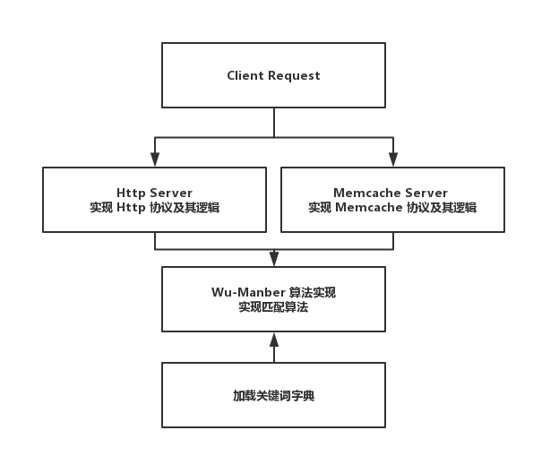

# 第一个项目

### 介绍

为了让大家跟好的入门 Adbase 的开发，我们采用一个完整的例子逐步的讲解开发过程。以开发一个多模匹配服务为例

#### 多模匹配服务

在实际业务开发中可能需要用到一个高性能的匹配服务，用来做关键词过滤等功能。本例中采用 Wu-Manber 多模匹配算法来实现匹配服务，具体的 Wu-Manber 算法实现细节大家没有必要深入研究，感兴趣的可以参考[Wu-Manber](https://memorycn.wordpress.com/2011/11/05/matching_algorithm_-_wu-manber_algorithm_based_on_the_the_suffix_search_of_multi-mode/)，本例子重点是利用这个应用场景来详细的讲解基于 Adbase 开发后端服务

#### 需求

编写一个支持 Http 、Memcache 协议通信的匹配服务，匹配的词典存放到文件中，在启动的时候加载，客户端通过 Http 或者 Memcache 协议给定匹配文本进行匹配计算，最终将匹配结果返回

- 交互数据格式

	- 参数: 
		
	```
	{
		"dict": "parrent_dict_name",
		"contents": [
			"近日俄罗斯两名五岁幼童越园了！两人经过预谋，用小铲子挖洞，逃出幼儿园要去买豪车！两人到了豪车展示厅，但是没钱买…一热心市民后将他们送到了警察局",
			"买枪, 卫星电视安装、卫星电视接收器材、电视锅、卫星锅"
		]
	}
	// dict ：由于该服务支持多个匹配关键词字典，指定匹配的字典
	// contents : 指定要匹配的文本内容
	```

	- 请求返回接口

	```
	{
		"code": 200,
		"exposure_id": "1441789531430499",
		"result": [
			{
				"hit": 5,
				"patterns": [
					"买枪",
					"卫星电视安装",
					"卫星电视接收器材",
					"卫星锅",
					"电视锅"
				]
			},
			{
				"hit": 0,
				"patterns": []
			}
		]
	}

	// 如果匹配到了列出匹配到的关键字和匹配到的个数，如果没有则返回空数组
	```

- Http 接口

	- 接口：/api/pattern
	- 请求方式：POST

- Memcache 接口

	- 使用 get 命令
	- key 为请求参数
	- 最终 get 返回的数据即为请求返回数据


### 需求分析

通过上述需求描述我们需要做的是实现 Wumanber 算法提供匹配计算，并且要实现 HTTP Server、Memcache Server 做网络交互, 在 Adbase 中有 Adbase Seed 基于 Adbase 进一步封装了 Http/Memcache Server 的实现，并且通过 Adbase Seed 生成的骨架代码替我们完成了整个项目构建等等一些列通用的代码。所以我们采用 Adbase 中的 Seed 生成项目骨架代码，然后基于这个骨架代码实现匹配逻辑即可, 大致的项目如图所示：



