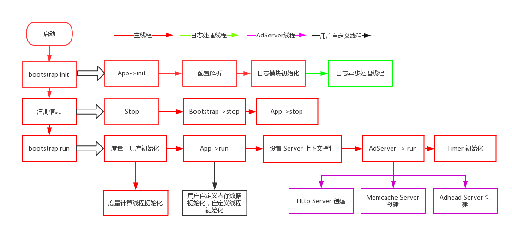

# 骨架代码

如下是是通过 seed 工具生成的代码骨架

```
.
├── adbase.ini
├── CMakeLists.txt 	项目构建 cmake 配置文件
├── cmake.sh
├── conf  项目配置文件
│   └── system.ini
├── rpm   项目打包 rpm 相关脚本配置
│   ├── build_rpm.in
│   └── pattern.spec.in
└── src   项目代码
    ├── AdbaseConfig.hpp	Adbase 全局配置
    ├── AdServer.cpp		AdServer 代码实现，包含 http memcache adhead server 实现
    ├── AdServer.hpp
    ├── App.cpp				App 项目入口，main 函数最终调用 bootstrap 后调用 app->run 执行
    ├── App.hpp
    ├── BootStrap.cpp	    项目引导初始化
    ├── BootStrap.hpp
    ├── CMakeLists.txt		cmake 配置文件
    ├── HeadProcessor.cpp
    ├── HeadProcessor.hpp
    ├── Http				Http 接口实现目录，如果扩展 http 接口请在此目录修改
    │   ├── Api.cpp			该项目配置生成器自动生成 /api/xxx 接口的 controller
    │   ├── Api.hpp
    │   ├── HttpInterface.cpp Http 接口实现基类
    │   ├── HttpInterface.hpp
    │   ├── Server.cpp		Seed 自动生成的用来实时查询整个项目的运行状态信息
    │   └── Server.hpp
    ├── Http.cpp			Http Server 实现
    ├── Http.hpp
    ├── McProcessor.cpp     Memcache Server 回调方法实现，如果实现 memcache 具体命令请修改该文件实现
    ├── McProcessor.hpp
    ├── pattern.cpp			项目 main 入口
    ├── Timer.cpp			定时器实现
    ├── Timer.hpp
    └── Version.hpp.in		自动管理版本
```

### 骨架代码运行流程图



如图所示本图按照不同的颜色将线程归类，主线程为红色的，日志处理线程为绿色、AdServer线程为紫色、用户自定义线程为黑色. 骨架代码在启动的时候会执行 bootstrap 初始化、注册信号回调、bootstrap run 三个过程，在 bootstrap run 中使用 evenloop 调用主线程进行工作。

- bootstrap init

	在执行 bootstrap init 这个阶段会做以下事情：

	- 将解析配置并且将配置对象 `AdbaseConfig` 保存在 BootStrap 中，贯穿项目整个生命周期
	- 初始化 daemon 守护进程
	- 初始化日志工具，创建日志异步处理线程

- 注册信号回调
	
	注册信号处理回调，骨架代码会处理两类型的信息，分别是终止类型的和 SIGUSR1 信号

	- 终止类型：调用 bootstrap stop 回收资源结束进程
	- SIGUSR1: 重新加载配置文件，开发者可以在 `App->reload` 方法中自定义在重载配置后执行的操作

- bootstrap run

	这个步骤是骨架代码核心的部分，也是在下一步实际开发中需要理解执行过程的一步，具体执行步骤如下：

	- 度量工具库初始化，该模块是用来统计项目运行时的一些状态参数
	- `App->run` 这个方法初始化情况下是空的，需要用户自定义，类似于 main 函数的功能，用户可以在这个方法中初始化线程，或者初始化内存堆变量等
	- 设置 AdServer 上下文指针，这个过程调用 `App->setAdServerContext` 方法，用户可以在该方法中设置传递给 Server 线程的变量指针，用来关联 RPC 服务数据源
	- 初始化启动 AdServer, 该过程是通过配置文件，默认骨架代码包含 Http/Memcache/Adhead Server的实现，可以根据需求在配置文件中配置要启动的 Server
	- 初始化定时器, 如果需要定义定时器，将在这个过程中初始化


### 骨架代码配置
