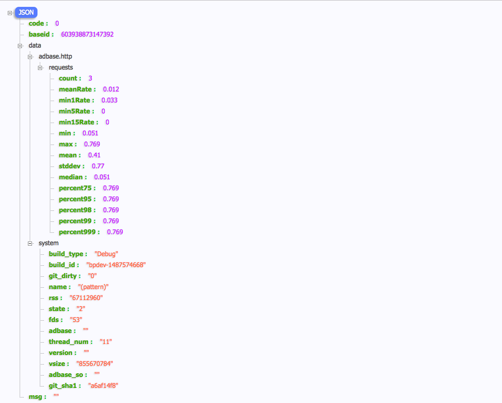

# Adbase Seed 生成项目骨架代码

为了快速入门第一个项目示例采用 Adbase Seed 生成项目骨架代码，Seed 在使用时仅需要配置一个 adbase.ini 配置文件，运行 `adbase_skeleton` 命令即可。假如该项目名称为 `pattern`，生成骨架代码的步骤如下：

#### 创建项目代码目录

```
mkdir pattern
cd pattern
```

#### 配置 adbase.ini 

在项目根目录中创建 adbase.ini 配置文件，内容如下
```
[project]
; 项目名称
ADINF_PROJECT_NAME=pattern
; 项目描述
ADINF_PROJECT_SUMMARY=Adbase case
; 项目主页
ADINF_PROJECT_URL=https://github.com/weiboad/adbase
; 项目打包维护信息
ADINF_PROJECT_VENDOR=nmred  <nmred_2008@126.com>
ADINF_PROJECT_PACKAGER=nmred  <nmred_2008@126.com>

[module]
; 是否启用生成 adserver 相关代码，如果使用 http/memcache rpc 服务请开启
adserver=yes
; 是否启用生成 timer 相关代码，如果需要定时执行一些操作请开启
timer=no
; 是否启用生成 kafka 相关代码，如果使用 kafka 做消息队列相关操作请开启
kafkac=no
kafkap=no
; 是否启用生成 logging 相关代码，建议开启
logging=yes

[params]
; 对于 timer 模块该参数生效，定时器名称，多个定时器用逗号分隔
timers=
; 对于 adserver 模块该参数生效，http server 的 controller 名称, 多个用逗号分隔
http_controllers=Api
;对于 aims consumer 模块该参数生效，分别是kafka consumer 名称、topic、groupid, 多个用逗号分隔, 三个参数的个数必须一一对应
kafka_consumers=
kafka_consumers_topics=
kafka_consumers_groups=
;对于 aims producer 模块该参数生效，分别是kafka producer 名称、topic, 多个用逗号分隔, 两个参数的个数必须一一对应
kafka_producers=
kafka_producers_topics=

[files]
src/main.cpp=src/@ADINF_PROJECT_NAME@.cpp
rpm/main.spec.in=rpm/@ADINF_PROJECT_NAME@.spec.in

[execs]
cmake.sh=1
build_rpm.in=1
```

在这个配置文件中对代码生成比较重要的配置信息是 project 段和 module 段，project 提供给生成器项目的一些基础信息，module 用来配置生成代码模块，由于本案例中仅仅使用 RPC 服务，所以仅需要选择 adserver 和 logging 模块即可，其他模块将在后续章节详细介绍

#### 运行 adbase_skeleton 生成代码

```
[zhongxiu@bpdev pattern]$ adbase_skeleton
20170220 06:21:26.441379Z 140081539787104 INFO  ./ - Seed.cpp:714
Generate file list:
	./rpm/pattern.spec.in
	./rpm/build_rpm.in
	./src/Timer.hpp
	./src/BootStrap.cpp
	./src/HeadProcessor.cpp
	./src/AdbaseConfig.hpp
	./src/McProcessor.hpp
	./src/pattern.cpp
	./src/Http.hpp
	./src/AdServer.hpp
	./src/McProcessor.cpp
	./src/HeadProcessor.hpp
	./src/AdServer.cpp
	./src/Http/Api.hpp
	./src/Http/Server.cpp
	./src/Http/HttpInterface.hpp
	./src/Http/Server.hpp
	./src/Http/Api.cpp
	./src/Http/HttpInterface.cpp
	./src/Timer.cpp
	./src/BootStrap.hpp
	./src/CMakeLists.txt
	./src/App.hpp
	./src/App.cpp
	./src/Http.cpp
	./src/Version.hpp.in
	./conf/system.ini
	./cmake.sh
	./CMakeLists.txt
```

#### 编译测试

- 生成项目构建配置

```
[zhongxiu@bpdev pattern]$ ./cmake.sh
Start cmake configure.....
编译 Debug 级别 [Debug(D)|Release(R)]: D
cmake -DCMAKE_BUILD_TYPE=Debug -DADINFVERSION= -DGIT_SHA1=a6af14f8 -DGIT_DIRTY=0 -DBUILD_ID=bpdev-1487574668 -DOPVERSION=el6.5 ..
-- The C compiler identification is GNU
-- The CXX compiler identification is GNU
-- Check for working C compiler: /usr/bin/gcc
-- Check for working C compiler: /usr/bin/gcc -- works
-- Detecting C compiler ABI info
-- Detecting C compiler ABI info - done
-- Check for working CXX compiler: /usr/bin/c++
-- Check for working CXX compiler: /usr/bin/c++ -- works
-- Detecting CXX compiler ABI info
-- Detecting CXX compiler ABI info - done
CMake Warning (dev) in CMakeLists.txt:
  No cmake_minimum_required command is present.  A line of code such as

    cmake_minimum_required(VERSION 2.6)

  should be added at the top of the file.  The version specified may be lower
  if you wish to support older CMake versions for this project.  For more
  information run "cmake --help-policy CMP0000".
This warning is for project developers.  Use -Wno-dev to suppress it.

-- Configuring done
-- Generating done
-- Build files have been written to: /usr/home/zhongxiu/code/adbase_case/pattern/build
```

- 编译项目

```
[zhongxiu@bpdev pattern]$ cd build/
[zhongxiu@bpdev build]$ make -j 12
Scanning dependencies of target pattern
[ 18%] [ 27%] [ 27%] [ 36%] [ 45%] [ 54%] [ 63%] [ 72%] [ 81%] Building CXX object bin/CMakeFiles/pattern.dir/pattern.o
Building CXX object bin/CMakeFiles/pattern.dir/BootStrap.o
Building CXX object bin/CMakeFiles/pattern.dir/App.o
Building CXX object bin/CMakeFiles/pattern.dir/AdServer.o
Building CXX object bin/CMakeFiles/pattern.dir/Http.o
Building CXX object bin/CMakeFiles/pattern.dir/Http/HttpInterface.o
Building CXX object bin/CMakeFiles/pattern.dir/Http/Server.o
Building CXX object bin/CMakeFiles/pattern.dir/Http/Api.o
Building CXX object bin/CMakeFiles/pattern.dir/McProcessor.o
[ 90%] [100%] Building CXX object bin/CMakeFiles/pattern.dir/HeadProcessor.o
Building CXX object bin/CMakeFiles/pattern.dir/Timer.o
Linking CXX executable pattern
[100%] Built target pattern
```

- 运行项目

```
[zhongxiu@bpdev build]$ mkdir logs
[zhongxiu@bpdev build]$ ./bin/pattern -c ../conf/system.ini
20170220 15:15:31.170330 140302409378144 TRACE initHttp Init http server, host:0.0.0.0 port:10110 - AdServer.cpp:87
20170220 15:15:31.170470 140302409378144 DEBUG Server Init Http Server. - Server.cpp:49
20170220 15:15:31.170554 140302409378144 DEBUG registerLocation Server Location: /server/status register success. - Server.cpp:245
20170220 15:15:31.170573 140302409378144 DEBUG registerLocation Server Location: /api/index register success. - Server.cpp:245
20170220 15:15:31.170641 140302409378144 DEBUG Acceptor Bind: 0.0.0.0:10111 - Acceptor.cpp:29
20170220 15:15:31.170813 140302409378144 DEBUG start Create worker thread success - Server.cpp:195
20170220 15:15:31.170910 140302409378144 DEBUG start Create worker thread success - Server.cpp:195
20170220 15:15:31.170907 140302398879488 DEBUG threadFunc Start create base event. - Server.cpp:122
20170220 15:15:31.171008 140302388389632 DEBUG threadFunc Start create base event. - Server.cpp:122
20170220 15:15:31.171101 140302398879488 TRACE threadFunc Worker start. - Server.cpp:136
20170220 15:15:31.171117 140302388389632 TRACE threadFunc Worker start. - Server.cpp:136
20170220 15:15:31.171136 140302388389632 DEBUG threadFunc Start create new evhttp. - Server.cpp:138
20170220 15:15:31.171139 140302377899776 DEBUG threadFunc Start create base event. - Server.cpp:122
20170220 15:15:31.171142 140302409378144 DEBUG start Create worker thread success - Server.cpp:195
20170220 15:15:31.171151 140302388389632 DEBUG threadFunc Start set evhttp onRequest callback. - Server.cpp:145
20170220 15:15:31.171175 140302388389632 DEBUG threadFunc Start bind evhttp socket, host:0.0.0.0 port:10110 - Server.cpp:151
20170220 15:15:31.171124 140302398879488 DEBUG threadFunc Start create new evhttp. - Server.cpp:138
20170220 15:15:31.171198 140302398879488 DEBUG threadFunc Start set evhttp onRequest callback. - Server.cpp:145
20170220 15:15:31.171176 140302377899776 TRACE threadFunc Worker start. - Server.cpp:136
20170220 15:15:31.171229 140302377899776 DEBUG threadFunc Start create new evhttp. - Server.cpp:138
20170220 15:15:31.171250 140302377899776 DEBUG threadFunc Start set evhttp onRequest callback. - Server.cpp:145
20170220 15:15:31.171321 140302398879488 DEBUG threadFunc Start set accecp evhttp socket. - Server.cpp:166
20170220 15:15:31.171347 140302409378144 DEBUG start Create worker thread success - Server.cpp:195
20170220 15:15:31.171373 140302377899776 DEBUG threadFunc Start set accecp evhttp socket. - Server.cpp:166
20170220 15:15:31.171405 140302367409920 DEBUG threadFunc Start create base event. - Server.cpp:122
20170220 15:15:31.171491 140302367409920 TRACE threadFunc Worker start. - Server.cpp:136
20170220 15:15:31.171511 140302367409920 DEBUG threadFunc Start create new evhttp. - Server.cpp:138
20170220 15:15:31.171521 140302367409920 DEBUG threadFunc Start set evhttp onRequest callback. - Server.cpp:145
20170220 15:15:31.171533 140302367409920 DEBUG threadFunc Start set accecp evhttp socket. - Server.cpp:166
20170220 15:15:33.183004 140302409378144 DEBUG start Create all worker thread, total 4 thread. - Server.cpp:202
20170220 15:15:33.183114 140302409378144 DEBUG start Create worker thread success - TcpServer.cpp:36
20170220 15:15:33.183192 140302409378144 DEBUG start Create worker thread success - TcpServer.cpp:36
20170220 15:15:33.183289 140302409378144 DEBUG start Create worker thread success - TcpServer.cpp:36
20170220 15:15:33.183324 140302234384128 TRACE start Worker start. - TcpWorker.cpp:50
20170220 15:15:33.183422 140302409378144 DEBUG start Create worker thread success - TcpServer.cpp:36
20170220 15:15:33.183440 140301884716800 TRACE start Worker start. - TcpWorker.cpp:50
20170220 15:15:33.183325 140302244873984 TRACE start Worker start. - TcpWorker.cpp:50
20170220 15:15:33.183528 140301874226944 TRACE start Worker start. - TcpWorker.cpp:50
```

- 测试 Http 接口
访问 http://127.0.0.1:10010/server-status 结果如图所示



- 测试 memcache server 

```
nmred@ubuntu12:~$ telnet 10.13.4.162 10111
Trying 10.13.4.162...
Connected to 10.13.4.162.
Escape character is '^]'.
version
VERSION 0.1.0
get test
VALUE test 0 4
test
END

```

如果上述测试通过恭喜你完成了 adbase 第一个项目的开发，下面将要做的就是将核心业务逻辑增加到项目中即可

走到这一步可能心里即窃喜又懵逼，窃喜的是很多代码自动完成了，仅仅需要写核心业务逻辑即可。懵逼的是生成这么一坨不知从何入手写业务逻辑，在正式开发前先介绍一下生成的代码的目录结构及其作用。
